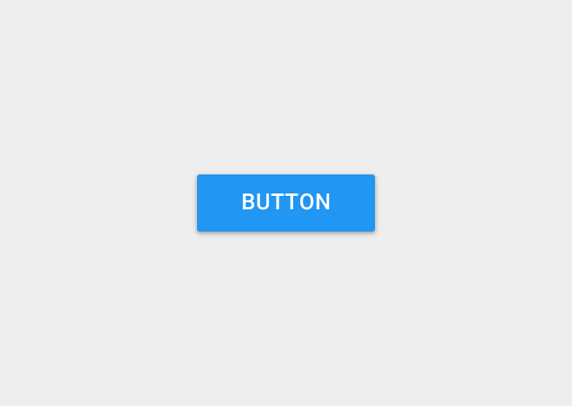

component: Button

# Button

## Overview

A button is a basic UI element with which the user can interact with your apps by tapping or 
clicking on it to perform an action.

  
{: class="preview-img" }

A typical button
{: .img-caption }

## Properties

{!includes/bgcolor-property.md!}

!!! caution ""
    If the _[Image](#image)_ property is set, then this is overriden.

{!includes/enabled-property.md!}

{!includes/all-font-properties.md!}

{!includes/height-property.md!}

### Image  
_**\(** Getter + Setter **\)**  
`Type: Asset`_ 

The image that is displayed on the button as a background.

!!! caution ""
    This property overrides the [Background Color](#background-color) property.

### Rotation Angle  
_**\(** Getter + Setter **\)**  
`Type: Number`_ 

The degrees that the **Button** is rotated around the pivot point. Increasing values result in clockwise rotation.

### Shape  
_**\(** Setter only **\)(** Designer Only **)**  
`Type: Text`_ 

The shape of the **Button**.

Options              | 
-------------------- | ------------
`Default`            | The default shape of the button i.e a standard button.
`Rectangular`        | The button is in rectangular shape , similar to `Default` shape.
`Rounded`            | The corners of the button are rounded giving it a shape like rounded rectangle.
`Oval   `            | The **Button** is in the shape of an oval.

{!includes/text-property.md!}

{!includes/width-property.md!}

{!includes/visible-property.md!}

## Methods

### Button Click
_**\(** None **\)**_ 

Perform a Button click. The Click event is also fired when this method is executed.

## Events

### Click
_**\(** None **\)**_ 

Indicates that the user has clicked the button \(i.e pressed and released\)

### Got Focus
_**\(** None **\)**_

Indicates the has been cursor moved over the button so it is now possible to click it.

### Long Click
_**\(** None **\)**_

Indicates that the user has clicked and held down the button. _Click_ event is not 
fired when the Button is long clicked.

### Lost Focus
_**\(** None **\)**_

Indicates the cursor moved away from the button so it is now no longer possible to click it.